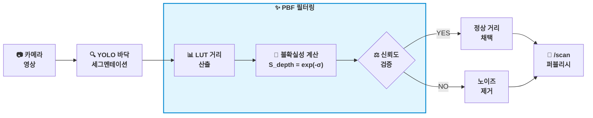

# 📄 MonoSAOD 논문 리뷰 & V-LiDAR 시스템 적용 방안 보고서

> **논문 제목**: MonoSAOD: Monocular 3D Object Detection with Sparsely Annotated Label (CVPR 2026 / arXiv:2604.01646)  
> **연구 기관**: 경희대학교 Visual AI Lab (Junyoung Jung, Seokwon Kim, Jung Uk Kim)  
> **연관 프로젝트**: V-LiDAR (Virtual LiDAR for Indoor Autonomous Navigation)

---

## 📌 1. 논문 한 문장 요약

> **"MonoSAOD는 라벨이 일부 누락된(Sparsely Annotated) 단안 카메라 환경에서, 3D 기하 구조를 보존하는 도로 기반 데이터 증강(RAPA)과 깊이 불확실성·특징 유사도 기반 의사 라벨 필터링(PBF)을 결합하여 고성능 3D 객체 탐지를 가능하게 하는 프레임워크이다."**

---

## 💡 2. MonoSAOD 핵심 논문 내용 정리

### (1) 연구 배경 및 문제 의식
* **3D 라벨링의 높은 비용**: 3D 바운딩 박스 라벨링은 2D 대비 3~16배의 시간과 비용이 소요되어, 실세계 데이터셋에는 라벨이 빠진(Sparse) 객체가 다수 존재함.
* **기존 SAOD 기법의 한계**: 기존 2D SAOD 방식은 2D 분류 신뢰도(Confidence)로만 가짜 정답(Pseudo-label)을 선택함. 하지만 Monocular 3D에서는 2D 신뢰도가 높아도 **3D 깊이(Depth) 및 방향(Orientation) 오차가 매우 클 수 있음**.

### (2) 핵심 제안 기법
1. **RAPA (Road-Aware Patch Augmentation)**:
   * SAM(Segment Anything Model)으로 3D 객체 패치를 추출.
   * 카메라 Extrinsic과 관찰각($\alpha$)을 유지하는 3D 기하 변환을 거쳐 target 도로 마스크($M_{road}$) 영역에 3D 일관성을 유지하며 배치.
2. **PBF (Prototype-Based Filtering)**:
   * **깊이 불확실성 검증 ($S_{depth}$)**: Laplacian aleatoric uncertainty ($\sigma$)를 기반으로 $S_{depth} = \exp(-\sigma)$ 계산.
   * **2D 피처 유사도 검증 ($S_{proto}$)**: ROI 피처와 대표 프로토타입 간 코사인 유사도 측정.
   * 두 기준을 모두 통과한 명확한 예측만 Pseudo-label로 승격하여 GT Bank 및 Student 네트워크 학습에 사용.

---

## 🔗 3. V-LiDAR와의 연관성 및 선택 이유

### (1) 연관성 및 선택 동기
* **공통의 목표**: 고가의 3D LiDAR 대신 **단안 카메라 1대만으로 3D 공간/거리 정보**를 얻고자 하는 목적이 동일함.
* **공통의 문제점**: 카메라 기반 거리 추정은 조명 변화, 바닥 빛 반사, 그림자 등으로 인해 순간적으로 거리 오차가 생기거나 **가짜 장애물(노이즈)이 튀는 한계점**을 공유함.

---

## 📐 4. PBF 방식을 결합한 V-LiDAR 벤치마킹 적용 방안

> 💡 **핵심 컨셉:** 무거운 AI 모델을 새로 훈련시키는 것이 아니라, 논문이 제안한 **"깊이 불확실성 검증(PBF)의 필터링 논리"**를 우리 V-LiDAR의 ROS 2 후처리 코드([`floor_detector.py`](file:///C:/Users/USER/Desktop/%EC%BA%A1%EC%8A%A4%ED%86%A4/V-Lidar-Research/src/freespace_detection/freespace_detection/floor_detector.py) / [`fake_lidar_with_tf.py`](file:///C:/Users/USER/Desktop/%EC%BA%A1%EC%8A%A4%ED%86%A4/V-Lidar-Research/src/fake_lidar_with_tf/fake_lidar_with_tf/fake_lidar_with_tf.py))에 가볍게 이식함.

### (1) PBF에서 가져오는 정확한 부분: `Geometric Reliability Score (S_depth)`
$$S_{depth} = \exp(-\sigma)$$
* $\sigma$ (Sigma): 깊이/거리 추정의 **불확실성 (Uncertainty)**
* $S_{depth}$: 거리 추정값의 **신뢰도 점수 (Reliability Score)**

### (2) PBF 결합 시스템 파이프라인 (Mermaid Diagram)

---

### (3) 단계별 상세 동작 메커니즘

1. **1단계 (LUT 거리 산출)**: 각 채널(열)별로 경계 픽셀 `y_bot`을 찾아 LUT 거리 후보 $d_t$를 계산.
2. **2단계 (불확실성 $\sigma$ 계산)**: 프레임 간 거리 변화량($|d_t - d_{t-1}|$) 또는 마스크 경계선 픽셀 분산으로 불확실성 $\sigma_{lut}$ 추정.
3. **3단계 (신뢰도 $S_{depth}$ 계산)**: PBF 수식 적용 $S_{depth} = \exp(-\sigma_{lut})$.
4. **4단계 (노이즈 필터링)**: $S_{depth} > \tau$이면 정상 거리로 채택하여 `/scan` 생성, $S_{depth} \le \tau$이면 빛 반사/그림자에 의한 노이즈로 간주하고 `inf` 처리하여 가짜 장애물 오탐을 예방.

---

### 🎯 5. 한 줄 기대 효과

> **"복잡한 AI 재학습 없이 기존 V-LiDAR의 ROS 2 노드에 PBF 불확실성 필터링 로직을 가볍게 추가하는 것만으로도, 빛 반사·그림자로 인한 가짜 장애물 오탐을 획기적으로 줄이고 자율주행 주행 안정성을 크게 높일 수 있음."**
