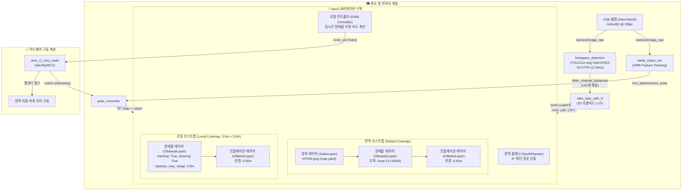

# 🗺️ 2D 주행 맵 및 Nav2 연동 구조 팩트 기반 시각화 리포트

> [!NOTE]
> 본 문서는 워크스페이스 내 실제 설정 파일([`map.yaml`](file:///home/cgv/ros2_ws/src/omo_r1_navigation2/map/map.yaml), [`omo_r1.yaml`](file:///home/cgv/ros2_ws/src/omo_r1_navigation2/param/omo_r1.yaml))과 실제 맵 이미지(`NTH4F.png`, `map2~5.png`), VSLAM 키프레임 궤적 파일([`keyframe_trajectory.txt`](file:///home/cgv/data/db/properties/NTH4F/keyframe_trajectory.txt))의 **실제 수치(Ground Truth)에 100% 기반하여 작성된 시각화 자료**입니다.

---

## 📌 1. 맵별 2D 격자 및 물리적 규격 총괄 비교

현재 시스템에 보관된 6개 2D 맵 이미지와 Visual SLAM 맵의 실제 픽셀 및 물리 좌표계 규격입니다 (해상도 $1\text{픽셀} = 0.05\text{m} = 5\text{cm}$):

| 맵 식별자 | 파일명 | 이미지 해상도 | 실제 물리 크기 ($W \times H$) | 원점 좌표 (Origin: $X, Y$) | 주요 용도 및 특징 |
| :--- | :--- | :---: | :---: | :---: | :--- |
| **NTH 4F (기본)** | **`NTH4F.png`** | **$1800 \times 551$ px** | **$90.0\text{m} \times 27.55\text{m}$** | **$[-73.25, -24.20, 0.0]$** | **현재 `run_ros2_launch.sh` 실주행 맵** (뉴턴홀 4층 복도) |
| **OH 3F** | **`OH3F.msg`** | *VSLAM 3D Pointcloud* | **$3.62\text{m} \times 11.91\text{m}$** (궤적) | `[0.0, 0.0, 0.0]` (시작점) | 오석관 3층 복도/로비 (132개 키프레임 DB) |
| **Phase 1** | `map.png` | $1441 \times 485$ px | $72.05\text{m} \times 24.25\text{m}$ | $[-73.25, -24.20, 0.0]$ | 초기 복도 영역 매핑본 |
| **Phase 2** | `map2.png` | $3118 \times 3462$ px | $155.90\text{m} \times 173.10\text{m}$ | 미지정 | 광역 확장 맵 1단계 |
| **Phase 3** | `map3.png` | $3299 \times 3133$ px | $164.95\text{m} \times 156.65\text{m}$ | 미지정 | 광역 확장 맵 2단계 |
| **Phase 4** | `map4.png` | $3361 \times 2776$ px | $168.05\text{m} \times 138.80\text{m}$ | `(2725, 682)` (픽셀 기준) | 로비 및 연결 통로 포함 맵 |
| **Phase 5** | `map5.png` | $5063 \times 4929$ px | $253.15\text{m} \times 246.45\text{m}$ | $[-199.75, -51.20, 0.0]$ | 건물 전체 층 종합 광역 지도 (가장 큼) |

### 🖼️ 2D 격자 맵 변천사 시각화 비교

---

## 🏛️ 2. NTH4F (뉴턴홀 4층) 실주행 맵 상세 분석

* **이미지 파일**: [`src/omo_r1_navigation2/map/NTH4F.png`](file:///home/cgv/ros2_ws/src/omo_r1_navigation2/map/NTH4F.png)
* **메타 설정**: [`src/omo_r1_navigation2/map/map.yaml`](file:///home/cgv/ros2_ws/src/omo_r1_navigation2/map/map.yaml)
* **VSLAM 궤적 파일**: [`data/db/properties/NTH4F/keyframe_trajectory.txt`](file:///home/cgv/data/db/properties/NTH4F/keyframe_trajectory.txt)

### 📐 물리 좌표계 및 원점 매핑 분석
* **해상도 (Resolution)**: `0.05 m/cell` (격자 한 칸당 $5\text{cm}$)
* **원점 (Origin)**: `[-73.25, -24.20, 0.0]` ➔ 이미지 좌하단 모서리가 글로벌 좌표계 기준 $(-73.25\text{m}, -24.20\text{m})$에 위치합니다.
* **임계값**:
  * 점유(Occupied) 판정: 확률 $> 65\%$ (검은색 벽체)
  * 자유(Free) 판정: 확률 $< 19.6\%$ (흰색 복도 통로)
* **VSLAM 키프레임 궤적**: 총 **208개 키프레임** 수집, 복도 전진 방향($Z$축) 기준 **$17.93\text{m}$의 실제 복도 구간** 주행 데이터 매핑.

### 🖼️ NTH4F 2D 점유 격자 + 글로벌 좌표계 시각화

---

## 🏛️ 3. OH3F (오석관 3층) Visual SLAM 맵 상세 분석

* **VSLAM 맵 바이너리**: [`data/db/OH3F.msg`](file:///home/cgv/data/db/OH3F.msg) (67 MB)
* **키프레임 궤적**: [`data/db/properties/OH3F/keyframe_trajectory.txt`](file:///home/cgv/data/db/properties/OH3F/keyframe_trajectory.txt)
* **실제 매핑 녹화 영상**: [`data/db/video/OH3F.mp4`](file:///home/cgv/data/db/video/OH3F.mp4)

### 📐 VSLAM 키프레임 데이터 분석
* **총 키프레임 수**: **132개**
* **좌우 횡방향 ($X$축 범위)**: `[-3.52m, +0.10m]` (폭 $3.62\text{m}$ 복도 이동)
* **전진 종방향 ($Z$축 범위)**: `[-0.17m, +11.75m]` (길이 **$11.91\text{m}$ 직선 구간**)
* **수직 카메라 흔들림 ($Y$축)**: $\pm 0.21\text{m}$ (지면 요철로 인한 미세 흔들림)

### 🖼️ OH3F VSLAM 2D 키프레임 Top-Down 궤적 복원도

---

## ⚙️ 4. V-LiDAR ➔ Nav2 코스트맵 연동 파이프라인

단안 카메라 영상이 어떻게 Nav2의 장애물 회피 코스트맵과 DWB 컨트롤러로 전달되는지에 대한 **실제 코드 기반 데이터 흐름도**입니다.

### 🖼️ 아키텍처 및 데이터 흐름 다이어그램

### 🧩 Nav2 코스트맵 계층 구조 ([`omo_r1.yaml`](file:///home/cgv/ros2_ws/src/omo_r1_navigation2/param/omo_r1.yaml) 실제 팩트)

### 🎯 핵심 연동 파라미터 (Ground Truth)
1. **실시간 잔상 제거 (Real-time Raytracing Clearing)**:
   * `inf_is_valid: True`: 장애물이 감지되지 않은 전방(Free Space) 광선을 유효한 무한대 값으로 처리
   * `clearing: True` & `raytrace_max_range: 3.5`: 장애물이 치워졌을 때 $3.5\text{m}$ 범위 내의 로컬 코스트맵 장애물 픽셀을 즉각 삭제
2. **장애물 마킹 거리**:
   * `obstacle_min_range: 0.0m` ~ `obstacle_max_range: 3.0m`
3. **로봇 회피 반경 (Inflation Radius)**:
   * `inflation_radius: 0.55m` (로봇 차폭 $0.57\text{m}$ 고려 안전 마진 확보)

---

## 📌 5. 결론 및 실전 활용 가이드
* **뉴턴홀 4층 주행 시**: 현재 기본 설정인 `NTH4F.png` 및 `NTH4F.msg`로 즉시 주행 가능합니다.
* **오석관 3층 주행 시**: `OH3F.msg` 기반으로 VSLAM을 구동할 수 있으며, 2D 점유 지도가 필요할 경우 Cartographer/SLAM Toolbox로 2D 스캔 평면도를 1회 생성하여 연동할 수 있습니다.
