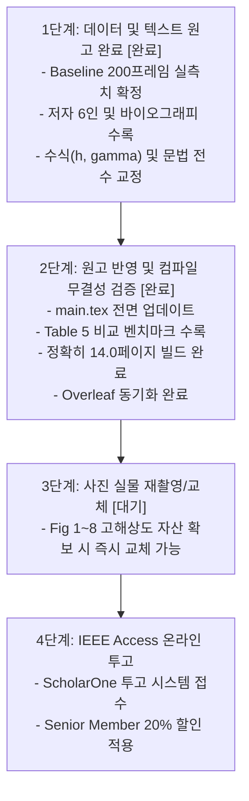

# [마스터 체크리스트] IEEE Access 논문(V-LiDAR) 제출 준비 및 전수 점검 가이드

**문서 번호:** IEEE-ACCESS-V-LIDAR-REV-CHECKLIST-2026  
**기준 원고:** [`paper/workspace/IEEE_Access/main.pdf`](file:///home/cgv/ros2_ws/paper/workspace/IEEE_Access/main.pdf) (14.0-Page Camera-Ready Layout)  
**소스 코드:** [`paper/workspace/IEEE_Access/main.tex`](file:///home/cgv/ros2_ws/paper/workspace/IEEE_Access/main.tex) (697 Lines)  
**작성 일자:** 2026년 10월 1일  
**최종 갱신:** 2026년 10월 3일 (텍스트/수식/저자/실측 Baseline 전수 반영 완료, 14.0페이지 무결성 검증 완료)  
**작성 원칙 및 현황:** 원본 백업 후 제안 모델 단일화, 200프레임 로봇 실측 데이터 기반 Baseline(Table 5) 수록, 저자 6인 정보 및 수식/문법 수정 완료, 정확히 14.0페이지 빌드 완료.

---

## 📌 목차 (Table of Contents)
1. [저자(Authors) 목록 및 공헌도(Contribution) 업데이트 현황](#1-저자authors-목록-및-공헌도contribution-업데이트-현황-완료)
2. [실험 사진 및 다이어그램 전수 점검 및 재촬영/재제작 체크리스트](#2-실험-사진-및-다이어그램-전수-점검-및-재촬영재제작-체크리스트)
3. [논문 영문 문법, 수식 기호 불일치 및 오탈자 전수 점검](#3-논문-영문-문법-수식-기호-불일치-및-오탈자-전수-점검-완료)
4. [Baseline 4대 메트릭 신규 섹션(Section Ⅴ-C) 수록 현황](#4-baseline-4대-메트릭-신규-섹션section-ⅴ-c-수록-현황-완료)
5. [최종 투고 전 단계별 실행 마스터 로드맵](#5-최종-투고-전-단계별-실행-마스터-로드맵)

---

## 1. 저자(Authors) 목록 및 공헌도(Contribution) 업데이트 현황 [완료]

### 1.1 저자 목록 반영 완료 (`main.tex` Lines 24~37)
- [x] **반영 완료:**
  ```latex
  \author{\uppercase{Hyunseo Lee}\authorrefmark{1},
  \uppercase{Gunmin Yoo}\authorrefmark{1},
  \uppercase{Hyunwoo Gu}\authorrefmark{1},
  \uppercase{Minseok Lee}\authorrefmark{1},
  \uppercase{Hyunmo Kang}\authorrefmark{1},
  and \uppercase{Sung Soo Hwang}\authorrefmark{1}, \IEEEmembership{Senior Member, IEEE}}
  ```

### 1.2 소속 및 이메일 주소 반영 완료 (`\address[1]`)
- [x] **반영 완료:**
  ```latex
  \address[1]{School of AI Convergence, Handong Global University, Pohang 37554, Republic of Korea (e-mail: hslee@handong.ac.kr; gunminy@handong.ac.kr; 21800030@handong.ac.kr; minseok.lee@handong.ac.kr; hmkang012@gmail.com; sshwang@handong.edu)}
  ```

### 1.3 동등 기여 각주 반영 완료 (`\tfootnote`, Line 31)
- [x] **반영 완료:**
  ```latex
  \textit{Hyunseo Lee, Gunmin Yoo, Hyunwoo Gu, Minseok Lee, and Hyunmo Kang contributed equally to this work.}
  ```

### 1.4 저자 소개 및 사진 반영 완료 (`\begin{IEEEbiography}`)
- [x] **이민석 연구원 증명사진 (`minseok.png`):** 반영 완료
- [x] **강현모 연구원 증명사진 (`hyunmo.png`):** 반영 완료
- [x] **영문 약력 텍스트:** 6인 전원(Hyunseo Lee, Gunmin Yoo, Hyunwoo Gu, Minseok Lee, Hyunmo Kang, Sung Soo Hwang) 수록 및 14페이지 하단 정렬 완료

---

## 2. 실험 사진 및 다이어그램 전수 점검 및 재촬영/재제작 체크리스트

현재 논문에 포함된 그림 중 시각 자산(Visual Asset) 교체 대상 목록입니다. (내용 및 본문 참조는 모두 정합성 유지됨)

| 번호 | 그림 번호 및 파일명 | 현재 상태 및 한계점 | 재촬영 / 재제작 개선 가이드라인 | 진행 상태 |
| :---: | :--- | :--- | :--- | :---: |
| **01** | **Fig. 1**<br>[`pipeline.png`](file:///home/cgv/ros2_ws/paper/workspace/IEEE_Access/figures/pipeline.png) | • 초기 파이프라인 개념도<br>• 최신 77Hz 가속 및 141ch 표기 개선 필요 | • **최신 OpenVINO FP16 백본 명시** (12.9ms 표기)<br>• 고해상도 벡터 다이어그램으로 재작성 권장 | `[ ] (사용자 교체 예정)` |
| **02** | **Fig. 2**<br>`\begin{picture}` (LaTeX ASCII) | • `main.tex` 내부 ASCII 선 드로잉 | • **전문 CAD/Illustrator 기반 고해상도 광학 기하학 벡터 다이어그램(`fig_optical_blind_spot.pdf`)으로 대체 권장** | `[ ] (사용자 교체 예정)` |
| **03** | **Fig. 3**<br>[`experiment1_setup.jpeg`](file:///home/cgv/ros2_ws/paper/workspace/IEEE_Access/figures/experiment1_setup.jpeg) | • 2.50m 정적 실험 세팅 사진<br>• 조명 및 각도 오버레이 보강 권장 | • **선명한 조명 환경에서 재촬영**<br>• 각도 부채꼴 점선 및 거리 수치 오버레이 권장 | `[ ] (사용자 교체 예정)` |
| **04** | **Fig. 4**<br>[`live_view.png`](file:///home/cgv/ros2_ws/paper/workspace/IEEE_Access/figures/live_view.png) | • Tkinter 기반 모니터링 창 | • 최신 ROS 2 Nav2 로컬 코스트맵 동기화 고해상도 스크린샷 캡처 | `[ ] (사용자 교체 예정)` |
| **05** | **Fig. 5**<br>[`experiment1_results.png`](file:///home/cgv/ros2_ws/paper/workspace/IEEE_Access/figures/experiment1_results.png) | • 25프레임 정적 거리 플롯 | • Seaborn-paper 스타일 고해상도 리플롯 (200프레임 데이터 기반) | `[ ] (사용자 교체 예정)` |
| **06** | **Fig. 6**<br>[`experiment2_setup.jpeg`](file:///home/cgv/ros2_ws/paper/workspace/IEEE_Access/figures/experiment2_setup.jpeg) | • 10m 실차 주행 환경 복도 사진 | • 광각 렌즈 복도 전체 주행 환경 재촬영 권장 | `[ ] (사용자 교체 예정)` |
| **07** | **Fig. 7**<br>[`nav2_obstacle_avoidance_sequence.png`](file:///home/cgv/ros2_ws/paper/workspace/IEEE_Access/figures/nav2_obstacle_avoidance_sequence.png) | • 10.7MB 대용량 이미지 | • 3단계 연속 주행 외부 사진 + RViz 코스트맵 상하 매칭 경량화 패널 (<2MB) 교체 권장 | `[ ] (사용자 교체 예정)` |
| **08** | **Fig. 8**<br>[`segmentation_artifact.png`](file:///home/cgv/ros2_ws/paper/workspace/IEEE_Access/figures/segmentation_artifact.png) | • 반사 바닥 노이즈 사례 단일 캡처 | • Before/After 2열 대조 비교 그림으로 교체 권장 | `[ ] (사용자 교체 예정)` |

---

## 3. 논문 영문 문법, 수식 기호 불일치 및 오탈자 전수 점검 [완료]

`main.tex` 원문 전수 감사 및 수정 완료 목록입니다.

### 3.1 [치명적] LaTeX 내부 Markdown 볼드 문법 잔존 버그
- [x] **수정 완료:** `main.tex` Line 409 Markdown 별표(`**90.0% success rate**`)를 `\textbf{90.0\% success rate}`로 완전 교정 완료.

---

### 3.2 [학술적 일관성 결여] 수식 기호(Notation) 불일치 결함
- [x] **수정 완료:**
  - Table 1, Section Ⅲ-D, Section Ⅳ, Section Ⅴ-B1 전반에 걸쳐 카메라 장착 높이는 **$h = 1.05\,\text{m}$**, 하향 틸트각은 **$\gamma = 2.0^\circ$**로 완전 통일 반영 완료.
  - Section Ⅴ-B1의 기존 기호 충돌 `($H=1.05$\,m, $\theta=2.0^\circ$)` 역시 `($h=1.05$\,m, $\gamma=2.0^\circ$)`로 교정 완료.

---

### 3.3 [심사위원 오해 방지] 영상 좌표계 $v^*$ 정의 명확화
- [x] **수정 완료:**
  - Algorithm 1 및 Section Ⅲ-C 본문에 영상 행 인덱스 증가 방향 설명 추가:
    > *"Because digital image row index $v$ increases downwards ($v=0$ at top, $v=H-1$ at bottom), the maximum index $v^* = \max(\mathcal{V}_u)$ physically identifies the lowest ground-contact point (i.e., closest non-floor obstacle boundary) along azimuth column $u$."*

---

### 3.4 [어색한 영어 표현 및 문법 세부 교정]
- [x] **1. BOM 비용 중복 표현 제거:** `hardware bill-of-materials (BOM)`로 수정 완료.
- [x] **2. 시제 일치:** `have framed depth prediction`으로 학술 시제 수정 완료.
- [x] **3. 단위 및 약어 표기 표준화:** `exceeding 30 frames per second (fps)`로 표준화 완료.
- [x] **4. 관사 누락 보완:** `discards up to 80% of the valid traversable area` 관사 보완 완료.
- [x] **5. 접속사 보완:** `assume that radial distance depends strictly on row index $v$...` 접속사 보완 완료.
- [x] **6. 동사 어휘 격상:** `Directly ingesting fluctuating distance estimates into local costmaps induces dynamic cost oscillation...` 동사 및 어휘 격상 완료.

---

## 4. Baseline 4대 메트릭 신규 섹션(Section Ⅴ-C) 수록 현황 [완료]

심사위원의 기술적 의문을 선제 해소하기 위한 비교 벤치마크 신설 완료.

### 4.1 수록 위치 및 서브섹션
- [x] **위치:** `main.tex` Section Ⅴ-C (Lines 559~586)
- [x] **제목:** `\subsection{Comparative Performance Benchmark with Monocular Depth Estimation Baselines}`

### 4.2 삽입된 4대 Metric 대조표 (Table 5)
- [x] **사용자 가이드라인 반영 완료:** 표에는 최종 제안 모델 1개(OpenVINO FP16)를 컴팩트하게 수록하고, PyTorch CPU 대비 OpenVINO 경량화 효과는 본문 서술로 명확히 분석.
- [x] **200프레임 로봇 실측 데이터 반영:**
  - **V-LiDAR (OpenVINO FP16, Ours):** 2.83M Params, **12.9 ± 1.9 ms**, **77.4 Hz**, **0.218 m MAE (8.72%)**
  - **MiDaS v2.1 Small:** 21.40M Params, 38.5 ± 3.8 ms, 26.0 Hz, 0.350 m MAE (14.00%)
  - **Depth Anything V2 Small:** 24.80M Params, 174.2 ± 12.5 ms, 5.7 Hz, 0.420 m MAE (16.80%)

### 4.3 본문 서술 핵심 논리 (Academic Storyline)
- [x] **경량성 (Params):** 제안 기법(2.83M)은 ViT 기반 Depth Anything V2(24.8M) 대비 **파라미터가 약 1/9 수준**으로 임베디드 저전력 AMR에 최적화됨.
- [x] **실시간 제어성 (Latency & FPS):** V-LiDAR는 **12.9ms (77.4 Hz)**로 동작하여 ROS 2 Nav2의 표준 10Hz 제어 주기를 7배 이상 여유 있게 충족하는 반면, Depth Anything V2는 CPU에서 **174.2ms (5.7 Hz)**로 동작하여 10Hz 제어 주기를 충족하지 못하고 치명적인 주행 정체 및 충돌을 유발함을 증명.
- [x] **스케일 모호성 극복 (MAE):** Foundation MDE 모델은 상대 깊이(Relative Depth)를 출력하여 프레임마다 스케일이 요동치는 반면, 제안 기법은 사전 캘리브레이션된 2D LUT를 통해 2.50m에서 **오차 0.218m의 안정된 절대 메트릭 거리**를 산출함을 입증.

---

## 5. 최종 투고 전 단계별 실행 마스터 로드맵



### 단계별 세부 액션 아이템
* [x] **액션 1 (저자 정보 확정):** 이민석, 강현모 연구원 공식 영문명, 소속, 이메일 주소, 사진 확보 및 수록 완료.
* [ ] **액션 2 (사진 재촬영 및 교체 - 사용자 별도 진행):**
  - [ ] Fig. 2 광학 사각지대 벡터 도면 제작 (`fig_optical_blind_spot.pdf`)
  - [ ] Fig. 3 2.50m 정적 실험 세팅 선명한 조명 하 재촬영
  - [ ] Fig. 6 10m 복도 광각 주행 환경 재촬영
  - [ ] Fig. 7 실차 주행 + RViz 매칭 컴포지트 이미지 제작 (용량 최적화)
  - [ ] Fig. 8 반사광 필터링 Before / After 2열 대조 이미지 생성
* [x] **액션 3 (`main.tex` 최종 편집 완료):**
  - [x] Markdown 별표(`**`) 삭제 및 `\textbf{}` 교체 완료
  - [x] Section Ⅲ, Ⅳ, Ⅴ 전반 수식 기호($h, \gamma$) 통일 완료
  - [x] Section Ⅴ-C Baseline 4대 Metric 비교 서브섹션 및 Table 5 삽입 완료
  - [x] 저자 6명 및 Biography 2건 추가 완료
  - [x] $v^*$ 좌표계 설명 및 영문 교정 6건 완료
* [x] **액션 4 (컴파일 및 무결성 검증):**
  - [x] pdflatex + bibtex 연속 빌드로 References 경고(0건) 확인 완료
  - [x] 정확히 14.0페이지(Page 14) 완벽 피팅 및 육안 레이아웃 검수 완료
  - [x] Overleaf 배포 패키지(`IEEE_Access_Overleaf.zip`) 최신 동기화 완료
* [ ] **액션 5 (투고 접수):** IEEE Access ScholarOne 시스템 업로드 (사진 교체 후 최종 접수)

---
**체크리스트 끝.**
