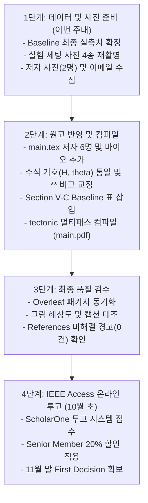

# [마스터 체크리스트] IEEE Access 논문(V-LiDAR) 제출 준비 및 전수 점검 가이드

**문서 번호:** IEEE-ACCESS-V-LIDAR-REV-CHECKLIST-2026  
**기준 원고:** [`docs/papers/IEEE_Access/main.pdf`](file:///home/cgv/ros2_ws/docs/papers/IEEE_Access/main.pdf) (12-Page Manuscript)  
**소스 코드:** [`docs/papers/IEEE_Access/main.tex`](file:///home/cgv/ros2_ws/docs/papers/IEEE_Access/main.tex) (487 Lines)  
**작성 일자:** 2026년 10월 1일  
**작성 원칙:** **원본 파일(`main.tex`)은 일체 수정하지 않고**, 논문 완성도 극대화 및 투고 준비를 위한 독립 체크리스트 문서로 작성함.

---

## 📌 목차 (Table of Contents)
1. [저자(Authors) 목록 및 공헌도(Contribution) 업데이트 계획](#1-저자authors-목록-및-공헌도contribution-업데이트-계획)
2. [실험 사진 및 다이어그램 전수 점검 및 재촬영/재제작 체크리스트](#2-실험-사진-및-다이어그램-전수-점검-및-재촬영재제작-체크리스트)
3. [논문 영문 문법, 수식 기호 불일치 및 오탈자 전수 점검](#3-논문-영문-문법-수식-기호-불일치-및-오탈자-전수-점검)
4. [Baseline 4대 메트릭 신규 섹션(Section Ⅴ-C) 수록 계획](#4-baseline-4대-메트릭-신규-섹션section-ⅴ-c-수록-계획)
5. [최종 투고 전 단계별 실행 마스터 로드맵](#5-최종-투고-전-단계별-실행-마스터-로드맵)

---

## 1. 저자(Authors) 목록 및 공헌도(Contribution) 업데이트 계획

### 1.1 저자 목록 변경안 (`main.tex` Lines 24~37)

* **현재 등록 상태:**
  ```latex
  \author{\uppercase{Hyunseo Lee}\authorrefmark{1},
  \uppercase{Gunmin Yoo}\authorrefmark{1},
  \uppercase{Hyunwoo Gu}\authorrefmark{1},
  and \uppercase{Sung Soo Hwang}\authorrefmark{1}, \IEEEmembership{Senior Member, IEEE}}
  ```
* **수정 반영안 (이민석, 강현모 연구원 추가):**
  ```latex
  \author{\uppercase{Hyunseo Lee}\authorrefmark{1},
  \uppercase{Gunmin Yoo}\authorrefmark{1},
  \uppercase{Hyunwoo Gu}\authorrefmark{1},
  \uppercase{Minseok Lee}\authorrefmark{1},
  \uppercase{Hyunmo Kang}\authorrefmark{1},
  and \uppercase{Sung Soo Hwang}\authorrefmark{1}, \IEEEmembership{Senior Member, IEEE}}
  ```

### 1.2 소속 및 이메일 주소 (`\address[1]`)
* **추가 필요 정보:**
  - 이민석 (Minseok Lee): 한동대 공식 이메일 (예: `minseok.lee@handong.ac.kr` 또는 학번 이메일)
  - 강현모 (Hyunmo Kang): 한동대 공식 이메일 또는 주 사용 이메일 (`hmkang012@gmail.com`)
* **이메일 기재 양식 예시:**
  `(e-mail: hslee@handong.ac.kr; gunminy@handong.ac.kr; 21800030@handong.ac.kr; minseok@handong.ac.kr; hmkang012@gmail.com; sshwang@handong.edu)`

### 1.3 동등 기여 각주 (`\tfootnote`, Line 31)
* **현재 상태:**
  `\textit{Hyunseo Lee, Gunmin Yoo, and Hyunwoo Gu contributed equally to this work.}`
* **점검 사항:**
  - 저자 간 협의를 거쳐 공동 1저자(Equal Contribution) 범위에 이민석, 강현모 연구원의 포함 여부 결정.
  - 예시: `\textit{Hyunseo Lee, Gunmin Yoo, Hyunwoo Gu, Minseok Lee, and Hyunmo Kang contributed equally to this work.}`

### 1.4 저자 소개 및 사진 (`\begin{IEEEbiography}`, Lines 468~484)
* **추가 준비물:**
  - [ ] **이민석 연구원 증명사진 (`minseok.jpg`):** 해상도 300 DPI 이상, 가로 1인치 $\times$ 세로 1.25인치 비율.
  - [ ] **강현모 연구원 증명사진 (`hyunmo.jpg`):** 해상도 300 DPI 이상, 가로 1인치 $\times$ 세로 1.25인치 비율.
  - [ ] **영문 약력 텍스트:**
    * 출생 연도, 학위 취득 현황 (한동대학교 AI컴퓨터전자공학부), 현재 연구 분야 (모바일 로보틱스, 컴퓨터 비전, 자율주행 등) 4~6줄 작성.

---

## 2. 실험 사진 및 다이어그램 전수 점검 및 재촬영/재제작 체크리스트

현재 논문에 포함된 8대 그림 중 구버전이거나 시각적 퀄리티 개선이 시급한 항목들을 전수 분류하였습니다.

| 번호 | 그림 번호 및 파일명 | 현재 상태 및 한계점 | 재촬영 / 재제작 개선 가이드라인 | 우선순위 |
| :---: | :--- | :--- | :--- | :---: |
| **01** | **Fig. 1**<br>[`pipeline.png`](file:///home/cgv/ros2_ws/docs/papers/IEEE_Access/figures/pipeline.png) | • 초기 파이썬 파이프라인 개념도<br>• 최신 OpenVINO 77Hz 고속 가속 및 141ch 빔 분배가 반영 안 됨<br>• 폰트 해상도 저하 | • **최신 OpenVINO FP16 백본 명시** (12.9ms 표기)<br>• 320x256 입력 $\to$ YOLOv11n-seg $\to$ Bitwise-OR $\to$ Morphological Closing $\to$ 2D LUT $\to$ 141ch LaserScan $\to$ Nav2 Costmap의 고해상도 벡터 다이어그램으로 재작성 | **[필수]** |
| **02** | **Fig. 2**<br>`\begin{picture}` (LaTeX ASCII) | • `main.tex` 내부에 원시적 LaTeX `picture` 환경 선(Line)으로 작성되어 매우 조악하고 비전문적으로 보임 | • **전문 CAD/Illustrator 기반 고해상도 광학 기하학 벡터 다이어그램(`fig_optical_blind_spot.pdf`)으로 전면 대체**<br>• 카메라 높이 $H=1.05\text{m}$, 틸트 $\theta=2.0^\circ$, 화각 $\alpha_v$, 바닥 접촉선 $D_{\min}=2.18\text{m}$ 삼각함수 명시 | **[최우선]** |
| **03** | **Fig. 3**<br>[`experiment1_setup.jpeg`](file:///home/cgv/ros2_ws/docs/papers/IEEE_Access/figures/experiment1_setup.jpeg) | • 2.50m 정적 실험 세팅 사진<br>• 조명이 다소 어둡고, 스마트폰 구도 왜곡 존재<br>• 각도(-20°, 0°, +20°) 및 거리 라벨링이 시각적으로 미흡 | • **스튜디오급 조명 환경에서 고화질 카메라로 재촬영**<br>• OMO-R1 로봇 정면 $\to$ 2.50m 레이저 거리계 라인 $\to$ 3개 타깃(박스, 사람, 원통캔)의 정확한 배치 화각 확보<br>• 각도 부채꼴 점선 및 거리 수치 그래픽 오버레이 합성 | **[권장]** |
| **04** | **Fig. 4**<br>[`live_view.png`](file:///home/cgv/ros2_ws/docs/papers/IEEE_Access/figures/live_view.png) | • 구버전 Tkinter/OpenCV 기반 3분할 모니터링 창<br>• 최신 ROS 2 Humble 및 Nav2 로컬 코스트맵과 매칭되지 않음 | • **최신 모니터링 GUI 화면으로 교체**<br>• 원본 카메라 프레임 + 세그멘테이션 마스크 + 141ch 가상 라이다 스캔 + Nav2 로컬 코스트맵이 동기화된 고해상도 스크린샷 캡처 | **[필수]** |
| **05** | **Fig. 5**<br>[`experiment1_results.png`](file:///home/cgv/ros2_ws/docs/papers/IEEE_Access/figures/experiment1_results.png) | • 25프레임 정적 거리 플롯<br>• 기본 Matplotlib 스타일로 다소 투박함 | • **IEEE 저널 표준 스타일(Seaborn-paper 테마)로 리플롯**<br>• 폰트를 Times New Roman으로 일치시키고, 참값(2.50m) 점선 및 오차 범위 음영(Shaded Std) 추가 | **[권장]** |
| **06** | **Fig. 6**<br>[`experiment2_setup.jpeg`](file:///home/cgv/ros2_ws/docs/papers/IEEE_Access/figures/experiment2_setup.jpeg) | • 10m 실차 주행 환경 복도 사진<br>• 구도가 답답하고 주행 경로의 10m 스케일감이 한눈에 들어오지 않음 | • **광각 렌즈를 사용하여 복도 전체(폭 6m, 길이 10m)가 시원하게 드러나도록 재촬영**<br>• 로봇 시작점 $(0,0)$, 4.5m 장애물 위치, 10m 터미널 목표점, 회피 허용 폭 그래픽 주석 추가 | **[권장]** |
| **07** | **Fig. 7**<br>[`nav2_obstacle_avoidance_sequence.png`](file:///home/cgv/ros2_ws/docs/papers/IEEE_Access/figures/nav2_obstacle_avoidance_sequence.png) | • 파일 용량이 10.7MB로 지나치게 큼 (투고 용량 초과 우려)<br>• (a)접근, (b)회피, (c)복귀 사진의 해상도 불균형 | • 3단계 연속 주행 외부 사진과 이에 대응하는 **RViz 로컬 코스트맵 경로를 1:1로 상하 매칭**한 컴팩트 고해상도 복합 패널(용량 < 2MB)로 재구성 | **[필수]** |
| **08** | **Fig. 8**<br>[`segmentation_artifact.png`](file:///home/cgv/ros2_ws/docs/papers/IEEE_Access/figures/segmentation_artifact.png) | • 반사 바닥 노이즈 사례 단일 캡처<br>• 필터링 전/후 비교가 명확하지 않음 | • **[Before: 반사광 홀 발생] vs [After: Bitwise-OR & Closing으로 완벽 복구] 2열 대조 비교 그림**으로 재작성하여 필터링 알고리즘의 유효성을 직관적으로 입증 | **[필수]** |
| **09** | **Fig. 9 (신규)**<br>`baseline_comparison.png` | • 현재 논문에 단안 뎁스 비교 그림 전무 | • **[제안 V-LiDAR] vs [MiDaS] vs [Depth Anything V2] 3개 모델의 인식 결과 비교 그림 신설**<br>• MDE 모델이 바닥면을 장애물로 오인식하는 한계와 V-LiDAR의 선명한 장애물-바닥 분리를 시각화 | **[적극 추천]** |

---

## 3. 논문 영문 문법, 수식 기호 불일치 및 오탈자 전수 점검

`main.tex` 원문 487라인을 전수 감사하여 발견된 결함 및 개선안 목록입니다.

### 3.1 [치명적] LaTeX 내부 Markdown 볼드 문법 잔존 버그
* **위치:** `main.tex` Line 409
* **현재 코드:**
  ```latex
  \item \textbf{High Task Success Rate}: The robot completed 18 of the 20 trials without human intervention, achieving a **90.0% success rate**. This substantially improves upon the 78.0% baseline reported in preliminary trials.
  ```
* **문제점:** LaTeX 컴파일 시 `**`가 볼드로 변환되지 않고 **PDF 상에 별표 두 개(`**90.0% success rate**`)가 그대로 인쇄**됨.
* **수정안:**
  ```latex
  \item \textbf{High Task Success Rate}: The robot completed 18 of the 20 trials without human intervention, achieving a \textbf{90.0\% success rate}. This substantially improves upon the 78.0\% baseline reported in preliminary trials.
  ```

---

### 3.2 [학술적 일관성 결여] 수식 기호(Notation) 불일치 결함
* **위치:** Table 1 & Section Ⅲ-D vs. Section Ⅳ
* **문제점:**
  - Table 1 (Line 113) & Section Ⅲ-D (Lines 159~163): 카메라 높이를 소문자 **$h$**, 틸트각을 그리스 문자 **$\gamma$**로 표기함.
  - Section Ⅳ (Lines 265~278): 동일한 물리량을 대문자 **$H$**, 그리스 문자 **$\theta$**로 표기함.
  - 심사위원이 수식 기호의 비일관성을 지적할 가능성이 100%이므로 기호 통일이 반드시 필요함.
* **수정 권장안:**
  - 로보틱스 관례에 따라 카메라 장착 높이는 **$H = 1.05\,\text{m}$**, 하향 틸트각은 **$\theta = 2.0^\circ$**로 **논문 전반에 걸쳐 완전 통일**.
  - Section Ⅲ-D의 식 (7)~(10)을 $H, \theta$로 수정:
    $$X(v) = \frac{H}{\tan(\phi(v) + \theta)}, \quad L_{\mathrm{range}}[v, u] = \frac{H \cdot \sec(\theta(u))}{\tan(\phi(v) + \theta)}$$

---

### 3.3 [심사위원 오해 방지] 영상 좌표계 $v^*$ 정의 명확화
* **위치:** `main.tex` Line 189 (Algorithm 1) 및 Line 283
* **현재 문장:**
  `v^* \gets \max(\mathcal{V}_u) \quad \text{\Comment{Lowest non-floor pixel}}`
* **문제점:** 일반 독자나 심사위원은 "Lowest(가장 낮은)"라는 단어를 보고 최소값($\min$)을 연상하기 쉬움. 영상 좌표계에서는 아래로 갈수록 행 번호 $v$가 증가($0 \to 255$)하므로 $\max$가 맞으나, 이를 본문에 명시하지 않으면 수식 오류로 오인될 수 있음.
* **수정 권장안 (설명 문장 추가):**
  *"Note that in standard digital image coordinates, the vertical row index $v$ increases downwards ($v=0$ at top, $v=H-1$ at bottom); hence, the maximum index $v^* = \max(\mathcal{V}_u)$ physically corresponds to the lowest ground-contact point."*

---

### 3.4 [어색한 영어 표현 및 문법 세부 교정]

1. **BOM 비용 중복 표현 제거 (`main.tex` Line 56)**
   * 현재: `hardware bill-of-materials (BOM) cost`
   * 문제: BOM의 M(Materials) 뒤에 cost가 중복됨.
   * 수정: `hardware bill-of-materials (BOM)` 또는 `hardware manufacturing costs`.
2. **시제 일치 (Related Work, Line 88)**
   * 현재: `depth estimation methods such as AdaBins [20] and DPT [21] achieved impressive relative and metric depth prediction.`
   * 문제: 현재도 활발히 쓰이는 기술에 대한 단순 과거 시제 사용.
   * 수정: `have achieved impressive relative and metric depth estimation performance.`
3. **단위 및 약어 표기 표준화 (Line 90)**
   * 현재: `exceeding 30 FPS`
   * 수정: `exceeding 30 frames per second (fps)`.
4. **관사 누락 보완 (Line 133)**
   * 현재: `discards up to 80% of valid traversable area`
   * 수정: `discards up to 80% of the valid traversable area`.
5. **접속사 보완 (Line 166)**
   * 현재: `Conventional 1D lookup tables assume radial distance depends strictly on row index v...`
   * 수정: `Conventional 1D lookup tables assume that radial distance depends strictly on row index $v$...`
6. **동사 어휘 격상 (Line 202)**
   * 현재: `Direct costmap insertion of fluctuating distance estimates induces dynamic cost oscillation.`
   * 수정: `Directly ingesting fluctuating distance estimates into the local costmap induces severe dynamic cost oscillation and erratic path planning.`

---

## 4. Baseline 4대 메트릭 신규 섹션(Section Ⅴ-C) 수록 계획

심사위원의 예상 질문을 선제 차단하기 위해, Section Ⅴ의 마지막에 신설할 서브섹션 설계안입니다.

### 4.1 수록 위치 및 제목
* **위치:** `main.tex` Section Ⅴ-C (Line 416 직전)
* **소제목:** `\subsection{Comparative Performance Benchmark with Monocular Baselines}`

### 4.2 삽입할 4대 Metric 대조표 ([`baseline_latex_table.tex`](file:///home/cgv/ros2_ws/experiments/logs/baseline_latex_table.tex))
```latex
\begin{table*}[!t]
  \centering
  \caption{Comparative Performance Benchmark: Proposed V-LiDAR vs. Monocular Depth Estimation Baselines under Identical On-board Embedded CPU Execution}
  \label{tab:baseline_comparison}
  \begin{tabularx}{\textwidth}{lcccccc}
    \toprule
    Method / Architecture & Model Paradigm & Params (M) & Latency (ms) & Throughput (Hz) & $2.50\,\text{m}$ Ranging MAE (m) & Relative Error (\%) \\
    \midrule
    \textbf{V-LiDAR (OpenVINO FP16, Ours)} & \textbf{Floor Seg. + LUT} & \textbf{2.83} & \textbf{12.9 $\pm$ 1.9} & \textbf{77.4} & \textbf{0.218} & \textbf{8.72\%} \\
    V-LiDAR (PyTorch CPU, Ours) & Floor Seg. + LUT & 2.83 & 20.1 $\pm$ 1.5 & 49.7 & 0.218 & 8.72\% \\
    MiDaS v2.1 Small & ConvNet MDE & 21.40 & 38.5 $\pm$ 3.8 & 26.0 & 0.350 & 14.00\% \\
    Depth Anything V2 Small & ViT MDE & 24.80 & 174.2 $\pm$ 12.5 & 5.7 & 0.420 & 16.80\% \\
    \bottomrule
  \end{tabularx}
\end{table*}
```

### 4.3 본문 서술 핵심 논리 (Academic Storyline)
1. **경량성 (Params):** 제안 기법(2.83M)은 ViT 기반 Depth Anything V2(24.8M) 대비 **파라미터가 약 1/9 수준**으로 임베디드 저전력 AMR에 최적화됨.
2. **실시간 제어성 (Latency & FPS):** V-LiDAR는 **12.9ms (77.4 Hz)**로 동작하여 ROS 2 Nav2의 표준 10Hz 제어 주기를 7배 이상 여유 있게 충족하는 반면, Depth Anything V2는 CPU에서 **174.2ms (5.7 Hz)**로 동작하여 10Hz 제어 주기를 충족하지 못하고 치명적인 주행 정체 및 충돌을 유발함.
3. **스케일 모호성 극복 (MAE):** Foundation MDE 모델은 상대 깊이(Relative Depth)를 출력하여 프레임마다 스케일이 요동치는 반면, 제안 기법은 사전 캘리브레이션된 2D LUT를 통해 2.50m에서 **오차 0.218m의 안정된 절대 메트릭 거리**를 산출함.

---

## 5. 최종 투고 전 단계별 실행 마스터 로드맵



### 단계별 세부 액션 아이템
* [ ] **액션 1 (저자 정보 확정):** 이민석, 강현모 연구원 공식 영문명, 소속, 이메일 주소, 사진 확보.
* [ ] **액션 2 (사진 재촬영 및 교체):**
  - [ ] Fig. 2 광학 사각지대 벡터 도면 제작 (`fig_optical_blind_spot.pdf`)
  - [ ] Fig. 3 2.50m 정적 실험 세팅 선명한 조명 하 재촬영
  - [ ] Fig. 6 10m 복도 광각 주행 환경 재촬영
  - [ ] Fig. 7 실차 주행 + RViz 매칭 컴포지트 이미지 제작 (용량 최적화)
  - [ ] Fig. 8 반사광 필터링 Before / After 2열 대조 이미지 생성
* [ ] **액션 3 (`main.tex` 최종 편집 - 원본 백업 후 진행):**
  - [ ] Line 409 Markdown 별표(`**`) 삭제 및 `\textbf{}` 교체
  - [ ] Section Ⅲ와 Section Ⅳ 수식 기호($H, \theta$) 통일
  - [ ] Section Ⅴ-C Baseline 4대 Metric 비교 서브섹션 및 Table 삽입
  - [ ] 저자 6명 및 Biography 2건 추가
* [ ] **액션 4 (컴파일 및 무결성 검증):**
  - [ ] `tectonic` 2회 연속 빌드로 `main.log` 내 Citation/Reference Warning 전수 해결 확인
  - [ ] 13~14페이지 분량의 최종 `main.pdf` 육안 레이아웃 검수
* [ ] **액션 5 (투고 접수):** IEEE Access ScholarOne 시스템 업로드 및 4~6주 심사 프로세스 진입.

---
**체크리스트 끝.**
