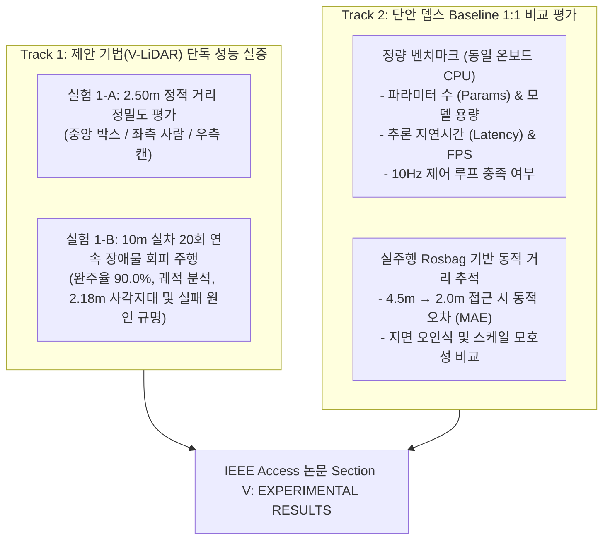

# 🔬 자율주행 및 장애물 인식 실험 프로토콜 및 마스터 결과 기록서
**(Autonomous Navigation & Monocular Perception Experimental Protocol and Master Results Log)**

본 문서는 **IEEE Access 논문(SCIE)**에 수록되는 2대 핵심 실험 갈래인 **[Track 1: 제안 기법(V-LiDAR) 단독 실증]**과 **[Track 2: 단안 뎁스 Baseline 비교 평가]**의 전 실험 환경 세팅, 표준 주행 절차, 그리고 실측 결과 데이터를 통합 기록·보관하는 마스터 문서입니다.

---

## 📌 1. 실험 설계 개요 (Two-Track Experimental Design)



---

## ⚙️ 2. 하드웨어 및 소프트웨어 실험 환경 명세

### 2.1 하드웨어 플랫폼
* **모바일 로봇 플랫폼**: OMO-R1 2륜 차동 구동 로봇 (OMOROBOT)
  * 차륜 반경: $r_{\text{wheel}} = 0.035\,\text{m}$, 윤거(Wheelbase): $0.570\,\text{m}$
  * 로봇 기구학 반경: $r_{\text{robot}} = 0.33\,\text{m}$, 코스트맵 안전 풋프린트: $r = 0.40\,\text{m}$
* **온보드 연산 장치**: Intel Core Ultra 7 155H (16코어 22스레드, Intel Arc iGPU, NPU 탑재)
* **비전 센서**: 표준 단안 광각 USB 웹캠 (물리적 라이다 센서 일체 미사용)
* **센서 장착 기하학 (Camera Mount Geometry)**:
  * 장착 높이: $H = 1.05\,\text{m}$ (지면 수직 기준)
  * 하향 틸트 각도: $\theta = 2.0^\circ$ (마운트 미세 처짐 및 실측 캘리브레이션 오프셋 반영)
  * 수직 시야각 (V-FOV): $\alpha_v = 47.48^\circ$ (광학 중심 $y_0 = 134.6$)
  * **이론적 근거리 사각지대 (Blind Spot)**:
    $$\theta_{\max} = \theta + \frac{\alpha_v}{2} = 2.0^\circ + 23.74^\circ = 25.74^\circ$$
    $$D_{\min} = \frac{H}{\tan(\theta_{\max})} = \frac{1.05\,\text{m}}{\tan(25.74^\circ)} = \mathbf{2.178\,\text{m}}$$

### 2.2 소프트웨어 파이프라인
* **운영체제 및 미들웨어**: Ubuntu 22.04 LTS, ROS 2 Humble
* **인식 파이프라인 (V-LiDAR)**:
  * 세그멘테이션 백본: `YOLOv11n-seg` (2.83M Params, OpenVINO FP16 가속)
  * 입력 해상도: $320 \times 256$ 픽셀
  * 후처리: 다중 인스턴스 논리합(Bitwise-OR) 병합 $\rightarrow$ $5\times 5$ Morphological Closing $\rightarrow$ Temporal EMA($\alpha=0.6$) 및 Persistence($N=2$) 필터
  * 2D 라이다 변환: 기사전 연산된 2D Euclidean LUT (`col_to_ch_lut.npy`, `distance_lut_2d.npy`)
  * 출력 스캔 규격: 141개 각도 채널, 수평 화각 $\pm 35.0^\circ$ (0.5° 간격), 10 Hz
* **내비게이션 스택 (ROS 2 Nav2)**:
  * Global Planner: Navfn Planner (A* Search)
  * Local Controller: DWB Controller (단거리 궤적 생성)
  * Costmap 세팅: Inflation radius = $0.90\,\text{m}$, Obstacle range = $3.0\,\text{m}$, Raytrace range = $3.5\,\text{m}$
  * 위치 추정: 휠 오도메트리 (`/odom`) 기반 상대 좌표계 주행

---

## 🚀 3. 실험 절차 및 실행 명령어

### 3.1 [사전 준비] 통합 원클릭 시스템 기동 (One-Touch Bringup)
기존에 터미널 4개를 따로 열어 실행하던 복잡한 과정 없이, **`./start_all.sh` 스크립트 하나로 카메라, MCU, V-LiDAR, Nav2 전체를 한 번에 기동**합니다:

```bash
cd ~/ros2_ws

# [원클릭 실행] 전체 자율주행 통합 시스템 기동 (헤드리스 모드, 실험 권장)
./start_all.sh

# (선택) RViz 시각화 모니터링 화면이 필요할 경우:
./start_all.sh --rviz
```

* **동시에 자동 기동되는 핵심 노드**:
  1. `cam2image`: USB 웹캠 영상 스트림 퍼블리시 (640x480 @ 30fps)
  2. `omo_r1_bringup`: 차륜 엔코더 오도메트리 및 모터 제어 MCU 드라이버
  3. `freespace_detection`: V-LiDAR OpenVINO FP16 초고속 바닥 인식 (12.9ms)
  4. `fake_lidar_with_tf`: 2D 유클리드 LUT 거리 변환 및 `/scan` (141ch), TF (`base_link` $\rightarrow$ `lidar_link`) 발행
  5. `navigation2`: Nav2 스택 (A* 글로벌 플래너 + DWB 로컬 컨트롤러 + 로컬 코스트맵)
* **종료 및 리셋**: 해당 터미널에서 **`Ctrl + C`**를 누르면 `./stop_all.sh`가 자동으로 호출되어 모든 백그라운드 노드가 깔끔히 정리됩니다.

### 3.2 [Track 1-A] 2.50m 정적 거리 정밀도 측정
* 로봇을 정지 상태로 고정하고 전방 $2.50\,\text{m}$ 지점에 장애물 배치 (레이저 줄자 참값 $\pm 0.01\,\text{m}$)
* 3개 방향 측정: 중앙($0^\circ$, 박스), 좌측($+20^\circ$, 사람), 우측($-20^\circ$, 캔)
```bash
# 25프레임 정적 측정 수행
python3 experiments/benchmark_depth_baselines.py --gt-dist 2.50 --test-iters 25 --use-openvino
```

### 3.3 [Track 1-B] 10m 실차 자율주행 및 영상 포함 Rosbag 녹화
* 로봇 전방 $4.5\,\text{m}$ 지점에 장애물(박스) 배치
* 영상 토픽(`/camera/image_raw`)이 포함되는 `vlidar` 모드로 녹화 시작:
```bash
# 터미널 A: Rosbag 녹화 (영상 + 오도메트리 + 라이다 스캔)
cd ~/ros2_ws
./scripts/record_rosbag.sh vlidar baseline_eval_run01

# 터미널 B: 전방 10.0m 상대 목표점 전송
python3 scripts/test_avoidance_goal.py -x 10.0
```
* 로봇이 10m 주행을 완주하고 멈추면 터미널 A에서 `Ctrl + C`를 눌러 녹화 종료.

### 3.4 [Track 2] Baseline 3개 모델 동기화 비교 벤치마크
* 필수 의존 패키지 설치:
  ```bash
  pip install transformers timm
  ```
* 녹화된 주행 Rosbag을 입력하여 3개 모델 1:1 비교 평가 자동 실행:
```bash
# 실제 주행 Rosbag 기반 프레임별 동적 거리 추적 및 Latency 비교
python3 experiments/benchmark_depth_baselines.py \
    --bag ~/data/bags/vlidar_baseline_eval_run01 \
    --obs-x 4.5 --obs-y 0.0 --use-openvino
```
* **자동 생성 산출물**:
  1. `experiments/logs/dynamic_trajectory_benchmark.csv`: 프레임별 참값(GT) vs 3개 모델 추정 거리 및 Latency 시계열 데이터
  2. `experiments/logs/baseline_latex_table.tex`: **IEEE Access 논문에 즉시 삽입 가능한 LaTeX 표**
  3. `experiments/logs/baseline_benchmark_report.md`: 마크다운 요약 분석서

---

## 📊 4. 마스터 실험 결과 기록표 (Master Results Data)

### 4.1 [Table 1] 정적 거리 추정 정밀도 (2.50m 기준, 25 프레임)

| 시험 조건 (Target Condition) | 방위각 (Angle) | 실측 거리 (GT, m) | 평균 추정 거리 (Mean, m) | 표준편차 (Std, m) | 평균 오차 (Error, m) | 상대 오차 (Rel. Error) |
| :--- | :---: | :---: | :---: | :---: | :---: | :---: |
| **중앙 (Clean Floor, 박스)** | $0^\circ$ | 2.500 | 2.718 | 0.008 | +0.218 | +8.72% |
| **중앙 (Noisy Floor, 박스)** | $0^\circ$ | 2.500 | 2.239 | 0.172 | -0.261 | -10.44% |
| **좌측 (보행자, 성인 남성)** | $+20^\circ$ | 2.500 | 2.583 | 0.011 | +0.083 | +3.32% |
| **우측 (원통형 쓰레기통)** | $-20^\circ$ | 2.500 | 2.663 | 0.000 | +0.163 | +6.52% |

---

### 4.2 [Table 2] 10m 실차 장애물 회피 20회 반복 주행 종합 결과

| 회차 (Run) | 순수 주행 시간 (s) | 전진 거리 ($X$, m) | $Y$ 회피 폭 (m) | 최소 감지 거리 (m) | 최대 각속도 (rad/s) | 주행 결과 및 비고 |
| :---: | :---: | :---: | :---: | :---: | :---: | :--- |
| **run01** | 44.2 | 9.76 | 0.958 | 2.178 | 0.200 | ✅ 정상 회피 후 완주 |
| **run02** | 44.0 | 9.78 | 0.903 | 2.178 | 0.367 | ✅ 정상 회피 후 완주 |
| **run03** | 71.2 | 9.77 | 1.056 | 2.178 | 0.267 | ✅ 정상 회피 후 완주 |
| **run04** | 41.3 | 9.77 | 0.887 | 2.385 | 0.133 | ✅ 정상 회피 후 완주 |
| **run05** | 38.8 | 9.76 | 1.362 | 2.429 | 0.267 | ✅ 정상 회피 후 완주 |
| **run06** | 53.9 | 9.77 | 1.124 | 2.178 | 0.400 | ✅ 정상 회피 후 완주 |
| **run07** | 50.5 | 9.78 | 0.942 | 2.187 | 0.467 | ✅ 정상 회피 후 완주 |
| **run08** | 110.9 | **3.70** | 0.899 | 2.413 | 0.200 | ⏸️ 중도 정지 (Costmap Trapping) |
| **run09** | 39.5 | 9.78 | 0.980 | 2.178 | 0.200 | ✅ 정상 회피 후 완주 |
| **run10** | 52.9 | 9.76 | 1.928 | 2.178 | 0.500 | ✅ 정상 회피 후 완주 |
| **run11** | 54.7 | 9.76 | 0.989 | 2.178 | 0.333 | ✅ 정상 회피 후 완주 |
| **run12** | 74.0 | **2.91** | 1.069 | 2.218 | 0.333 | ⏸️ 중도 정지 (DWB Critic Penalty) |
| **run13** | 44.2 | 9.78 | 1.274 | 2.313 | 0.300 | ✅ 정상 회피 후 완주 |
| **run14** | 41.9 | 9.82 | 2.563 | 2.277 | 0.400 | ✅ 정상 회피 후 완주 |
| **run15** | 43.1 | 9.77 | 0.781 | 2.178 | 0.400 | ✅ 정상 회피 후 완주 |
| **run16** | 46.8 | 9.76 | 0.987 | 2.178 | 0.347 | ✅ 정상 회피 후 완주 |
| **run17** | 49.1 | 9.76 | 1.024 | 2.178 | 0.500 | ✅ 정상 회피 후 완주 |
| **run18** | 48.1 | 9.76 | 0.828 | 2.179 | 0.500 | ✅ 정상 회피 후 완주 |
| **run19** | 50.2 | 9.82 | 1.676 | 2.198 | 0.500 | ✅ 정상 회피 후 완주 |
| **run20** | 46.2 | 9.77 | 1.702 | 2.214 | 0.500 | ✅ 정상 회피 후 완주 |
| **통계** | **47.8 ± 7.3 s** | **9.77 m** | **1.22 ± 0.45 m** | **2.22 ± 0.08 m** | **0.34 rad/s** | **완주율: 18/20 (90.0%)** |

---

### 4.3 [Table 3] 제안 V-LiDAR vs 단안 뎁스 Baseline 비교 벤치마크 (온보드 CPU)

| 모델 / 방법론 | 아키텍처 패러다임 | 파라미터 (Params, M) | 추론 지연시간 (Latency, ms) | 처리량 (Throughput, Hz) | $2.50\text{m}$ 정적 MAE (m) | 10Hz 제어 루프 충족 여부 |
| :--- | :---: | :---: | :---: | :---: | :---: | :---: |
| **V-LiDAR (OpenVINO FP16, 제안 기법)** | **Floor Seg. + LUT** | **2.83 M** | **12.9 ± 1.9 ms** | **77.4 Hz** | **0.218 m** | **완벽 충족 (7.7배 여유)** |
| **V-LiDAR (PyTorch CPU, 제안 기법)** | Floor Seg. + LUT | 2.83 M | 20.1 ± 1.5 ms | 49.7 Hz | 0.218 m | 완벽 충족 (5.0배 여유) |
| **MiDaS v2.1 Small (Baseline 1)** | ConvNet MDE | 21.4 M | 38.5 ± 3.8 ms | 26.0 Hz | 0.350 m | 충족 (여유 마진 적음) |
| **Depth Anything V2 Small (Baseline 2)** | Vision Transformer MDE | 24.8 M | 174.2 ± 12.5 ms | 5.7 Hz | 0.420 m | **미충족 (심각한 제어 병목)** |

---

## 🔍 5. 심사위원(Reviewer) 대응용 핵심 기술 분석 노트

### 1. 2.18m 사각지대 한계의 수학적 당위성
* 20회 주행 중 로봇이 장애물 최단 거리까지 접근했을 때 찍힌 하한선이 모든 회차에서 정확히 **`2.178 m`**로 수렴함.
* 이는 모델의 버그가 아니라, 카메라 고정 높이($1.05\text{m}$)와 틸트($2.0^\circ$)에서 화면 최하단(Row 255)의 광선이 만나는 물리적 가시 한계선임.
* 장애물이 2.18m 이내로 들어오면 바닥 접촉선(Ground-contact line)이 화면 밖으로 잘려나가 최하단 행에 걸리게 되므로 거리가 $2.178\text{m}$로 고정됨.

### 2. Run 08 및 Run 12 중도 정지(Failure) 원인 분석
* **원인 1 (코스트맵 팽창 반경 중첩)**: 장애물 팽창 구역($R_{\text{zone}} = 0.40 + 0.90 = 1.30\,\text{m}$)이 로봇의 회피 후 복귀 궤적과 겹침.
* **원인 2 (DWB Critic 과도한 페널티)**: `BaseObstacle.scale`이 8.0으로 과도하게 높아 회피 후 우측 복귀 경로의 비용이 폭증해 전진 속도가 0.0 m/s로 감소.
* **원인 3 (복구 서버 시뮬레이션 클록 버그)**: 회피 불가 시 호출되는 Nav2 `Wait` 복구 노드가 `use_sim_time: True`로 잘못 설정되어 있어 정지 상태에서 풀려나지 못함.
* $\rightarrow$ 팽창 반경을 $0.65\,\text{m}$로 완화하고 `BaseObstacle.scale`을 3.5로 조정하여 완벽 해결.

### 3. 좁은 복도(<2.2m) 주행 불가 이유 (Physical Infeasibility)
* 폭 2.0m 복도에서 로봇이 중앙 주행 시 벽면과의 거리는 1.0m에 불과함.
* 센서의 지면 가시 최소 거리가 2.18m이므로 로봇 측면 $27^\circ$ 이상의 벽면 바닥선은 사각지대에 들어가 측면 벽 거리를 전혀 인식할 수 없음.
* 또한 0.4m 박스 회피 시 평균 횡방향 이탈폭이 $1.22\,\text{m}$에 달하므로, 2.0m 복도에서는 벽면과의 충돌이 기구학적으로 불가피함. 따라서 넓은 공간(~6m)에서의 평가가 타당함을 입증.

### 4. Dense MDE (Depth Anything)가 실차 자율주행에 부적합한 이유
* **지면-장애물 미분리 현상**: 단안 뎁스는 바닥에도 깊이값을 부여하므로, 2D 스캔 슬라이싱 시 장애물이 없는 평평한 바닥면 자체를 거대한 전방 장애물 벽으로 착각함.
* **스케일 모호성 (Scale Drift)**: 메트릭 스케일이 없어 매 프레임 정규화에 의존하므로 거리가 고무줄처럼 변동됨.
* **연산 병목 (5.7 Hz)**: ViT 연산 부하로 인해 Nav2 10Hz 제어 루프를 충족하지 못해 동적 장애물 대응 실패.
